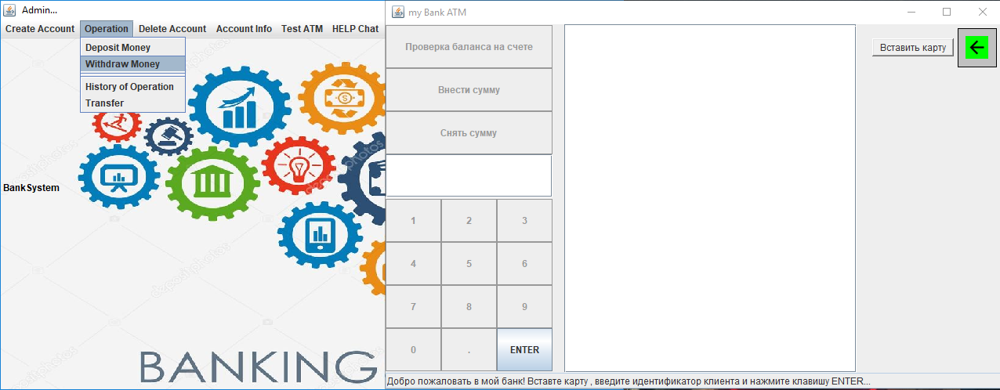

# SimpleDesktopBankSystem

semeter project in 3 semester on the subject of OOP

The purpose of the development of the project (demo) of the banking system to simplify the use of core banking operations by bank employees.

## Features

- [x] Create a new account
- [x] Make deposits and withdrawals
- [x] Perform transactions from one account to another
- [x] Access account information
- [x] Delete account
- [x] Provide online assistance to clients in case of any questions(firstly should run ChatServer.java for communication with users).
- [x] Testing payments via ATM (does not work properly)

## Requirements
Java 8

## Common Technologies
Project is created with:
* Swing

## Entry point
Administrator.java or SignIn.java

